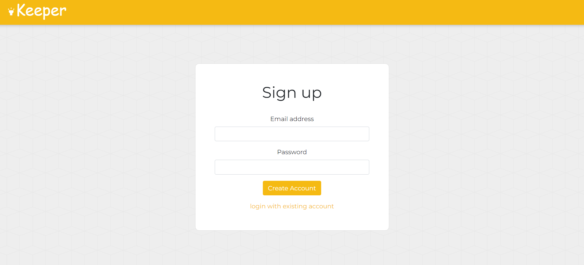
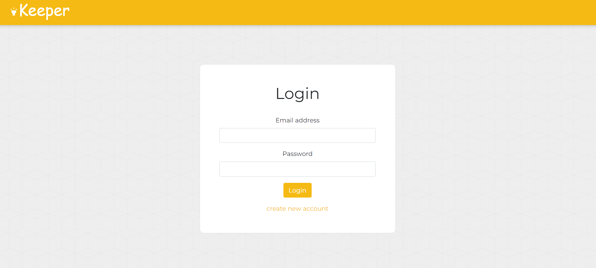
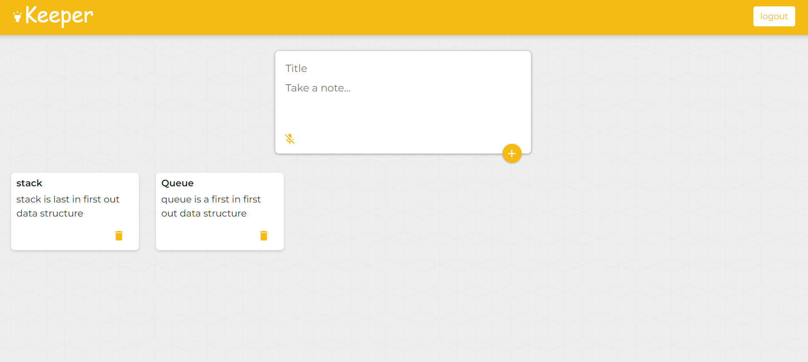

# Keeper app

A Note keeping web app.
Keep all your notes in one place.


## Run Locally

Clone the project

```bash
  git clone https://github.com/yash-jain24/Keeper-Frontend.git
```

Go to the project directory

```bash
  cd my-project
```

Install dependencies

```bash
  npm install
```

Start the server

```bash
  npm run start
```


## built with
* [react](https://reactjs.org/)
## Screenshots


